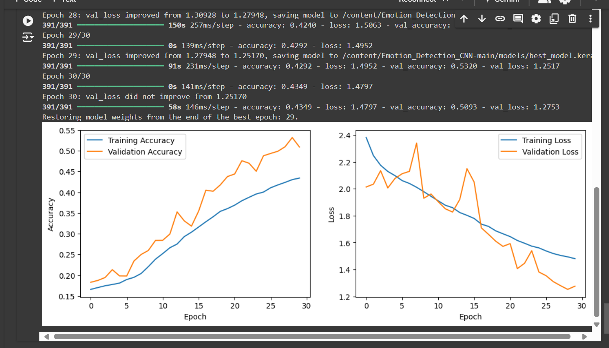

---

# Emotion Detection CNN

This project implements a Convolutional Neural Network (CNN) for emotion detection using the FER dataset. The model architecture includes feature pyramid layers, batch normalization, and data augmentation for improved accuracy. 

The model is trained to classify images into one of seven emotions: `angry`, `disgust`, `fear`, `happy`, `neutral`, `sad`, and `surprise`.

## Directory Structure

```
Emotion_Detection_CNN-main/
│
├── emotion_classification_cnn.py       # Script for training the CNN model
├── main.py                             # Main script to run emotion detection
├── haarcascade_frontalface_default.xml # Pre-trained model for face detection
│
├── FER/
│   └── images/
│       ├── train/                      # Training dataset (FER dataset)
│       │   ├── angry/
│       │   ├── disgust/
│       │   ├── fear/
│       │   ├── happy/
│       │   ├── neutral/
│       │   ├── sad/
│       │   └── surprise/
│       └── validation/                 # Validation dataset (FER dataset)
│           ├── angry/
│           ├── disgust/
│           ├── fear/
│           ├── happy/
│           ├── neutral/
│           ├── sad/
│           └── surprise/
└── models/
    └── saved_model.keras               # Placeholder for the final trained model
    └── best_model.keras                # Placeholder for the best model (checkpoint)
```
## NOTE
download dataset from "https://www.kaggle.com/datasets/jonathanoheix/face-expression-recognition-dataset" and add it to the FER folder as shown in directory

## Installation

To install the necessary dependencies, you can use the provided `requirements.txt`. Here's how to set up the environment:

1. Clone the repository:
   ```bash
   git clone https://github.com/Chorko/Emotion_Detection_CNN-main.git
   cd Emotion_Detection_CNN-main
   ```

2. Install dependencies using pip:
   ```bash
   pip install -r requirements.txt
   ```

Here are the key dependencies:
```
numpy
opencv-python
tensorflow
keras
pyttsx3
matplotlib
h5py
scipy
scikit-learn
optuna
keras-tuner
ray
```

You can also use a virtual environment or Anaconda environment to manage dependencies.

## Model Training

The trained model is **not provided** due to file size limitations. To train the model, you need to run `emotion_classification_cnn.py`. Here's how:

1. **Prepare the FER dataset**: Ensure the `train/` and `validation/` directories are structured as shown in the directory structure above, with subfolders for each emotion.
   
2. **Train the model**: Run the training script to train the model on the FER dataset.
   ```bash
   python emotion_classification_cnn.py
   ```

   The model will be saved in the `models/` directory upon completion. The best model during training will be saved as `best_model.keras`.

3. **Recommended**: Use **Google Colab** for faster training if you don't have access to a GPU locally.

## Running the Emotion Detection

Once the model is trained, you can run the emotion detection using `main.py`. This script will:

- Load the trained CNN model.
- Use OpenCV to detect faces in real-time from a webcam feed.
- Classify the detected faces into one of the seven emotions.
  
To run the script:
```bash
python main.py
```

Make sure the `haarcascade_frontalface_default.xml` file is in the same directory as `main.py`, as it will be used for face detection.

## Notes

- **Training time**: Depending on your hardware, training the model might take some time. Using a GPU is recommended for faster processing. I would recommend using Google Colab for training the model.
- **Saving models**: The trained models will be saved in the `models/` directory.

---
